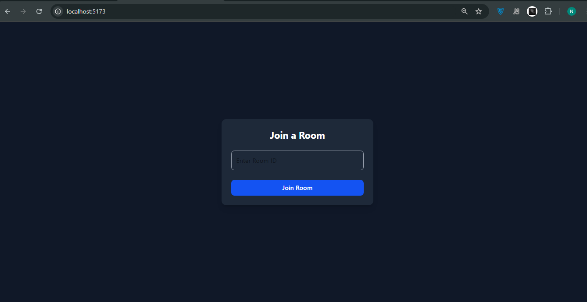
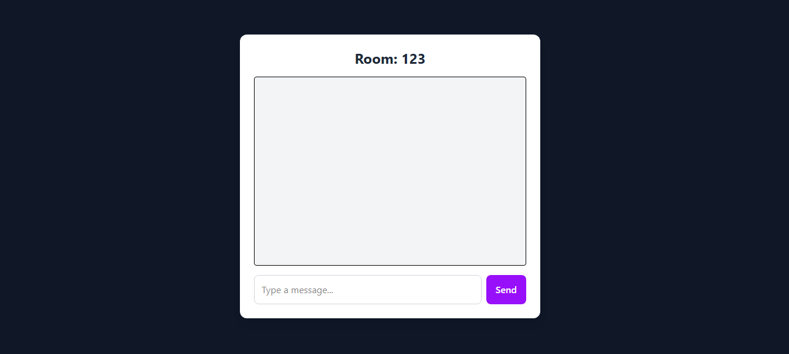

## 💬 WebSocket Chat Room

A lightweight real-time chat application built with **React**, **TypeScript**, and **WebSockets**. Users can join a room using a unique `Room ID` and exchange messages instantly with others in the same room.

---

### 🚀 Features

* 📡 Real-time messaging with WebSocket
* 🧠 Room-based chat functionality
* 🗃️ Room ID stored in localStorage (auto-join after refresh)
* 💡 Lightweight frontend with Tailwind CSS
* 📦 Built using TypeScript (frontend + backend)
* ✅ Responsive UI

---

### 📁 Project Structure

```
.
├── backend
│   └── src
│       └── index.ts       # WebSocket server using ws
├── frontend
│   └── src
│       └── App.tsx        # React chat app
│       └── main.tsx
│       └── index.css
├── README.md
├── package.json
```

---

### 🛠️ Tech Stack

* **Frontend**: React + TypeScript + Tailwind CSS
* **Backend**: Node.js + TypeScript + ws (`WebSocket` library)

---

### ⚙️ Getting Started

#### 1. Clone the repository

```bash
git clone https://github.com/inaveed-git/WebSocket-ChatApp.git
cd WebSocket-ChatApp
```

---

#### 2. Setup Backend

```bash
cd backend
npm install
npm run dev
```

> This will start the WebSocket server on `ws://localhost:8080`.

---

#### 3. Setup Frontend

```bash
cd frontend
npm install
npm run dev
```

> This will start the React app on `http://localhost:5173` (Vite default port).

---

### 📷 Preview




---

### 🧪 Usage

1. Start both the **frontend** and **backend**.
2. Open the app in the browser.
3. Enter a `Room ID` to join a chat room.
4. Start chatting with others who join the same room!

---

### 📌 Notes

* The app uses a single WebSocket connection.
* Messages are **not persisted** — no database.
* Designed for local use or learning purposes.

---


### 🧑‍💻 Author

**Naveed khan**
GitHub: [@inaveed-git](https://github.com/inaveed-git)


## License

This project is licensed under the [MIT License](./LICENSE).
